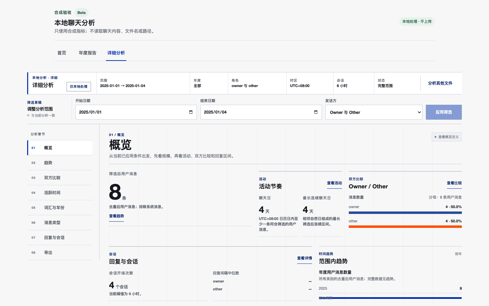
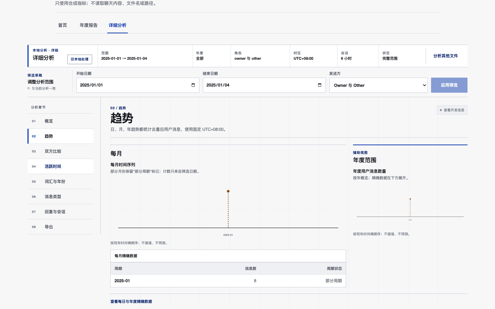

# Chat History Analysis

一个在本机完成处理、不会上传聊天数据的 CipherTalk 聊天记录分析工具。它把 `detailed-json` 导出转换为经过严格校验、确定性去重的本地数据集，并提供年度回顾、详细分析、词频/词云、时间趋势、双方比较、回复与会话以及聚合结果导出。

> 当前版本：`v0.1.0 Alpha` · macOS 11+ · Apple Silicon（arm64）
>
> 当前安装包使用 ad-hoc 签名，尚未经过 Apple Developer ID 签名与 notarization；请先阅读[安装说明](#安装)。

[下载最新版](https://github.com/ChestnutleeEd/ChatHisotryAnalysis/releases/latest) · [使用指南](#使用) · [隐私与安全](#隐私与安全) · [开发与构建](#从源码运行与开发)

## 界面预览

以下截图全部使用仓库中的合成数据生成，不包含真实聊天内容、联系人、文件名或本地路径。

### 年度回顾


### 详细分析



### 趋势分析



## 功能介绍

### 完全本地的处理流程

- 原始 `detailed-json` 以只读方式打开，聊天数据不会上传，也不需要账号、云服务或远程 API。
- 桌面应用内置 Python sidecar、分析 Worker 和前端资源；安装版不要求用户安装 Python、Node.js、npm 或 Conda。
- 对输入执行严格 UTF-8/JSON、消息结构、时间、容量与文件身份校验。
- 多文件按固定规则合并、排序和去重；可额外选择 overlap verification 文件进行重叠检查，验证文件不计入最终统计。
- 中间数据保存在权限受限的本地会话目录中，替换数据或退出应用时自动清理。

### 年度回顾

年度回顾以连续阅读的形式展示：

- 消息规模、聊天日和最长连续聊天区间；
- 月份、星期与小时活动节奏；
- Owner / Other 消息占比和文字长度；
- 消息类型、会话发起方和回复间隔；
- 常用词、年度关键词、本地词云和可分享回顾卡；
- 完整范围与部分日期范围提示，避免把不完整数据误读为全年结论。

### 详细分析

详细模式包含 8 个页面：

| 页面 | 内容 |
| --- | --- |
| 概览 | 消息规模、聊天日、连续区间、双方比较、回复与会话摘要 |
| 趋势 | 按日、月、年查看消息变化，保留部分周期标记 |
| 双方比较 | Owner / Other 的消息数量、占比与 eligible text 长度 |
| 活跃时间 | 小时、星期、聊天日、月份与连续聊天区间 |
| 词汇与年份 | 常用词、年度关键词、词频变化、词云和净化词控制 |
| 消息类型 | 15 个稳定消息类别及 eligible-text、unknown、system diagnostic |
| 回复与会话 | 回复间隔、会话发起次数及 1/3/6/12/24 小时阈值 |
| 导出 | 当前已应用筛选结果的聚合 JSON、CSV 和图表 PNG |

所有日期都按 `UTC+08:00` 解释，日期范围包含开始日和结束日。筛选条件包括日期、发送方、年份以及会话阈值。应用只提供可验证的聚合统计，不进行情绪、关系质量、人格或心理推断。

### 导出

- **JSON**：带版本和统计口径的结构化聚合结果；
- **CSV**：适合继续整理或制图的聚合表格；
- **PNG**：当前图表或本地生成的回顾卡。

导出文件不包含聊天正文，但统计模式仍可能属于敏感信息，请谨慎保存和分享。

## 系统要求

安装版当前只支持：

- Apple Silicon Mac（arm64，M1/M2/M3/M4 等）；
- macOS 11.0 或更高版本；
- CipherTalk `detailed-json` 原始导出。

当前不支持 Intel Mac、Windows、直接连接微信/CipherTalk 数据库、数据库解密、其他聊天平台格式、账号同步或自动更新。

## 安装

### 使用 Release 安装包（推荐）

1. 打开 [GitHub Releases](https://github.com/ChestnutleeEd/ChatHisotryAnalysis/releases/latest)，下载 `Chat-History-Analysis-v0.1.0-macos-arm64.dmg`。
2. 双击 DMG，把 `Chat History Analysis.app` 拖到“应用程序”或其他本地目录。
3. 在 Finder 中找到应用，右键选择“打开”，再确认打开。
4. 后续可以像普通应用一样双击启动。

因为当前 Alpha 使用 ad-hoc 签名且未 notarize，macOS 可能提示“无法验证开发者”。请只针对这个应用使用 Finder 的“右键 → 打开”，或按系统提示前往“系统设置 → 隐私与安全性”批准本次启动。不要关闭整个 Gatekeeper，也不要执行全局绕过安全检查的命令。

安装后无需额外下载运行时依赖。发布页同时提供 SHA-256，可在终端校验下载文件：

```bash
shasum -a 256 ~/Downloads/Chat-History-Analysis-v0.1.0-macos-arm64.dmg
```

将输出与 Release 说明中的 SHA-256 对比；两者必须完全一致。

### 卸载

退出应用后，把 `Chat History Analysis.app` 移到废纸篓即可。应用没有账号、云端数据或常驻后台服务。

## 使用

### 1. 准备数据

从 CipherTalk 导出一个或多个 `detailed-json` 文件。年度源可以覆盖不同年份或存在重叠，应用会进行确定性合并和去重。

请勿把真实聊天导出放进本仓库。开发时只允许将其保存在已忽略的 `data/private/` 或 `data/exports/` 中。

### 2. 导入并分析

1. 启动应用并阅读隐私说明。
2. 点击“选择年度源”，选择一个或多个 CipherTalk `detailed-json` 文件。
3. 如需验证数据重叠，单独选择可选 verification 源；它只用于检查，不会加入统计。
4. 点击“开始分析”，等待输入校验、预处理、本地数据交接和 Worker 分析完成。
5. 在“年度报告”与“详细分析”之间切换查看结果。

应用不会修改原始 JSON。处理失败时只显示稳定错误类别和恢复操作，不会回显文件路径、联系人或聊天正文。

### 3. 筛选和阅读结果

- 修改开始日期、结束日期或发送方后，点击“应用筛选”；
- 在“回复与会话”中选择 1/3/6/12/24 小时会话阈值并应用；
- 在词汇区域切换 Owner / Other、原始次数 / 每万词频率和净化常用词；
- 旧结果会在新计算完成前保留并标记为待更新，防止把草稿条件误认为已生效条件。

### 4. 导出结果

进入“导出”页面，确认当前已应用的范围、角色、时区、指标版本和页面后，再保存 JSON、CSV 或 PNG。取消系统保存面板不会修改分析结果。

## 隐私与安全

- **不上传**：生产应用运行时不访问远程分析服务，不上传原始文件或聚合结果。
- **不保留正文**：分析界面和导出只使用版本化聚合 DTO，不展示消息正文、联系人身份、账号、文件名或绝对路径。
- **最小化数据**：只有符合规则的规范化事件进入临时数据集；URL、XML、占位符等内容按固定策略过滤。
- **确定性校验**：输入、chunk 和 manifest 均有严格 schema、计数、排序、大小与 SHA-256 校验。
- **会话清理**：临时分析会话在替换数据或退出时清理；异常启动会执行恢复检查。
- **无遥测**：没有账号、云同步、广告或遥测。

本项目无法替代磁盘加密、系统账号安全和稳妥的本地备份。真实聊天文件与导出的聚合统计都应按敏感数据管理。

## 从源码运行与开发

普通用户应优先使用 Release 安装包。以下步骤面向开发者。

### 前置环境

- macOS arm64；
- Node.js `^20.19.0`、`^22.13.0` 或 `>=24.0.0`；
- npm `>=10 <12`；
- Rust/Cargo 与 Tauri 2 所需的 macOS 开发工具；
- CPython 3.12（仅 Python 预处理器和打包流程）。

### 浏览器开发模式

```bash
cd frontend
npm ci
npm run dev
```

然后打开 `http://127.0.0.1:5173/`。也可以在 Finder 中双击仓库根目录的 `Start Chat Analysis.command`；脚本会检查依赖、构建并启动本地浏览器版本。使用 `Stop Chat Analysis.command` 停止该项目实例。

> 浏览器入口只接受已经预处理的 normalized dataset，不接受原始 CipherTalk 导出；原始导入请使用桌面应用。

### Tauri 桌面开发模式

在前端依赖安装完成后：

```bash
npm --prefix frontend run build
npm --prefix frontend exec -- tauri dev --config src-tauri/tauri.dev.conf.json
```

桌面端依赖受信任 sidecar 和目标平台构建边界；首次开发前请先阅读 [`docs/PREPROCESSOR_RUNTIME.md`](docs/PREPROCESSOR_RUNTIME.md) 与 [`docs/MACOS_ALPHA_BUILD.md`](docs/MACOS_ALPHA_BUILD.md)。

### 构建 macOS Alpha

```bash
scripts/build_macos_alpha.sh
```

构建脚本会检查目标架构和锁定依赖，构建 frontend、PyInstaller onedir sidecar 和 Tauri `.app`，执行 nested-first ad-hoc 签名，生成 DMG，并运行离线合成 smoke 与安装包验收。产物位于已被 Git 忽略的 `build/stage11/macos-arm64/`。

详细构建条件、验证命令和信任边界见 [macOS Alpha 构建与验收](docs/MACOS_ALPHA_BUILD.md)。

## 测试与质量检查

```bash
# TypeScript
npm --prefix frontend run type-check
npm --prefix frontend run lint
npm --prefix frontend test

# 浏览器端到端测试（会先构建生产前端）
npm --prefix frontend run test:browser:preview

# Rust
cargo fmt --manifest-path src-tauri/Cargo.toml -- --check
cargo test --manifest-path src-tauri/Cargo.toml --locked --lib --tests

# Python
PYTHONDONTWRITEBYTECODE=1 PYTHONPATH=src \
  python3.12 -m unittest discover -s tests -v
```

安装包可以使用 manifest 再次验收：

```bash
scripts/verify_macos_alpha.sh /absolute/path/to/package-manifest.json
```

测试、截图和 fixtures 只使用合成数据。

## 技术架构

```text
CipherTalk detailed-json（只读）
        │
        ▼
Python sidecar：流式校验、规范化、合并、去重
        │  canonical v2 / NDJSON + manifest
        ▼
Tauri/Rust host：进程监督、权限、数据交接、原生保存
        │  opaque dataset handle
        ▼
Web Worker：严格复验、索引、聚合、Jieba WASM 分词
        │  versioned aggregate DTO
        ▼
React UI：年度回顾、详细分析、词云、JSON/CSV/PNG 导出
```

核心技术：Tauri 2、Rust、React 19、TypeScript、Vite、ECharts、Jieba WASM、Python 3.12、ijson、SQLite 和 PyInstaller。

## 项目结构

```text
frontend/        React UI、分析 Worker、词云布局与浏览器测试
src-tauri/       Tauri/Rust host、IPC、进程监督、缓存与导出
src/             Python 流式预处理器与 canonical dataset
contracts/       跨语言协议和合成测试向量
data/mock/       可提交的合成 CipherTalk fixture
scripts/         构建、启动、打包和验收脚本
tests/           Python 与集成测试
docs/            数据格式、运行边界、验收记录和用户指南
openspec/        产品变更的 proposal、design、spec 与 tasks
output/          可提交的合成界面截图
```

## 常见问题

### 为什么应用打不开？

当前包尚未 notarize。请确认下载自本仓库 Release 且 SHA-256 一致，然后在 Finder 中右键应用选择“打开”。不要全局关闭 Gatekeeper。

### 为什么不能选择微信数据库或其他 JSON？

当前只支持 CipherTalk `detailed-json` 的明确 schema。限制输入格式可以保持校验、去重和统计结果可复现，也避免尝试解密或猜测未知数据结构。

### 分析是否会联网？

安装版的分析流程不依赖网络，也没有上传、账号、云同步或遥测。只有下载安装包和开发者首次安装依赖需要网络。

### 重叠文件会重复统计吗？

年度源会按稳定身份进行跨文件确定性去重。可选 verification 源只用于重叠验证，不贡献年度统计。

### 能否分享导出的结果？

可以，但即使不含正文，日期、频率、回复和会话模式仍可能敏感。分享前应复核范围并征得相关人员同意。

## 已知限制

- Alpha 仅提供 macOS arm64 包；
- ad-hoc 签名，未做 Developer ID 签名、notarization 或 stapling；
- 不支持自动更新和正式发布级供应链认证；
- 不支持损坏到无法解析的 JSON 或超过声明容量限制的数据；
- 未对所有真实数据分布、极限容量或正式发布级 p95 性能作承诺；
- 当前仓库未附开源许可证，默认保留所有权利。

完整边界见 [Alpha Release Notes](docs/ALPHA_RELEASE_NOTES.md) 和 [用户手动测试指南](docs/MACOS_ALPHA_USER_TEST_GUIDE_ZH.md)。

## 反馈

提交 Issue 时请只提供不含聊天正文的环境和现象信息：应用版本、macOS 版本、Mac 型号、文件数量、近似年份范围、问题步骤、可见错误码和已经去除隐私信息的截图。

请勿上传真实聊天 JSON、联系人、账号、手机号、路径、原始统计结果或包含私人内容的日志。
